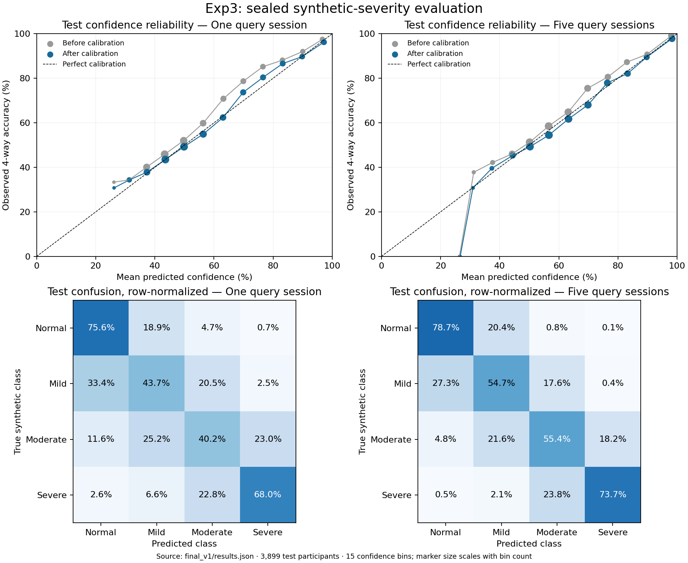

# Exp3 result: the 70–80% target was not met

Final models and calibration were frozen before the final validation/test pass. Both observation budgets classify all four classes; chance accuracy is 25%.

## Sealed scores

- **Validation, single: 56.93% accuracy** (participant-bootstrap 95% CI 56.18%–57.68%); pooled detection EER 19.37%; calibration ECE 1.29 percentage points; NLL 0.9339; multiclass Brier 0.5319. 1,171 participants, 23,420 labeled observations.
- **Validation, bundle: 66.31% accuracy** (participant-bootstrap 95% CI 65.05%–67.55%); pooled detection EER 13.64%; calibration ECE 1.67 percentage points; NLL 0.7410; multiclass Brier 0.4427. 1,171 participants, 4,684 labeled observations.
- **Test, single: 56.90% accuracy** (participant-bootstrap 95% CI 56.45%–57.31%); pooled detection EER 19.61%; calibration ECE 1.12 percentage points; NLL 0.9382; multiclass Brier 0.5338. 3,899 participants, 77,980 labeled observations.
- **Test, bundle: 65.61% accuracy** (participant-bootstrap 95% CI 64.91%–66.30%); pooled detection EER 14.07%; calibration ECE 1.39 percentage points; NLL 0.7469; multiclass Brier 0.4451. 3,899 participants, 15,596 labeled observations.

The five-session result uses five distinct query sessions under one shared synthetic profile, plus ten clean enrollment sessions. It is not a single-session accuracy. The test confidence interval is below 70%. These experiments do not establish that 70% is mathematically impossible.

## What was selected

The final classifier combines a summary-feature boosted tree with the full-gallery temporal model. The sequence-only model supplied initialization but received zero direct ensemble weight.
- single: tree/sequence-only/full-gallery weights [0.5, 0.0, 0.5]; temperature 0.830694; selection accuracy 56.70%.
- bundle: tree/sequence-only/full-gallery weights [0.25, 0.0, 0.75]; temperature 0.843313; selection accuracy 65.74%.

The first temporal run used 100 epochs; the full-gallery run stopped at epoch 64 after 20 epochs without selection improvement. The full-gallery checkpoint selected for both budgets is epoch 44. The two temporal training runs took approximately 44.5 minutes, excluding preprocessing, other model searches and final evaluation.

## What remains difficult

- single test recall: normal 75.6%, mild 43.7%, moderate 40.2%, severe 68.0%.
- bundle test recall: normal 78.7%, mild 54.7%, moderate 55.4%, severe 73.7%.

The errors are concentrated in adjacent severity classes, especially mild and moderate. Confidence calibration does not recover missing class separation. Reasonable calibration here applies to the balanced synthetic distribution, not an independently validated clinical population.

## Integrity and scope

- The generator and severity labels were unchanged. No source-query twin, latent burden, pause mask or class metadata enters inference.
- All classes share millisecond rounding and terminal-transition exclusion. A selection-only 5-ms stress audit reduced sequence-only accuracy by 0.25 points (single) and 0.17 points (five sessions).
- Training, model selection, calibration, final validation and test use disjoint participants. The final test subset was specified before modeling; 3,899 of 4,000 requested participants passed the predeclared completeness rule.
- This is a subset of the historical v4 test cohort, whose aggregate results were already discussed in earlier experiments. It is not a new external dataset. Exp3 used new synthetic draws and no final-test fitting or selection.
- A queued process imported the full-gallery architecture before a later source edit. This caused an invalid initial checkpoint replay. The actual trained architecture was restored; every weight tensor was unchanged; its selection accuracy and log loss reproduced exactly. The invalid replay, original metadata, recovery record and proof are retained. No final-validation or test data had been opened when this was corrected.
- Twelve control tests passed. Inference matched evaluation exactly on all four synthetic classes and both observation budgets.
- Calibration and test artifacts include full confusion counts, reliability-bin counts, participant-bootstrap intervals and per-observation probabilities. No abstention, relabeling, favorable-seed selection or test-driven retraining was used.

## Files and use

- Main frozen choices and temperatures: `runs/final_v1/freeze.json`.
- Sealed metrics: `runs/final_v1/results.json`; saved probabilities: `runs/final_v1/{validation,test}_{single,bundle}_predictions.npz`.
- Recovery proof: `runs/relational_v1/reproduced_selection.json` and `architecture_recovery.json`.
- Invalid replay: `runs/final_v1_invalid_architecture_replay/` (not a valid experimental trial).
- Inference parity proof: `runs/final_v1/inference_parity.json`.

```bash
python3 -m prototype_net.exp3.final_predict observed_sessions.npz --budget bundle
```

Inputs are ten clean enrollment sessions and five query sessions for bundle mode. See `final_predict.py` and `README.md` for shapes and the single-session option. Generated models and caches remain on disk and are excluded from Git.


